# _Disk Analysis_

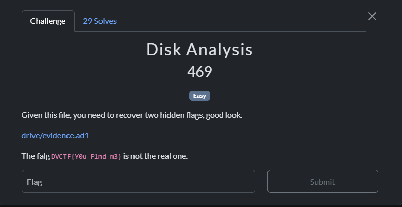

Theo thói quen check trong `console history` thì có ngay được flag

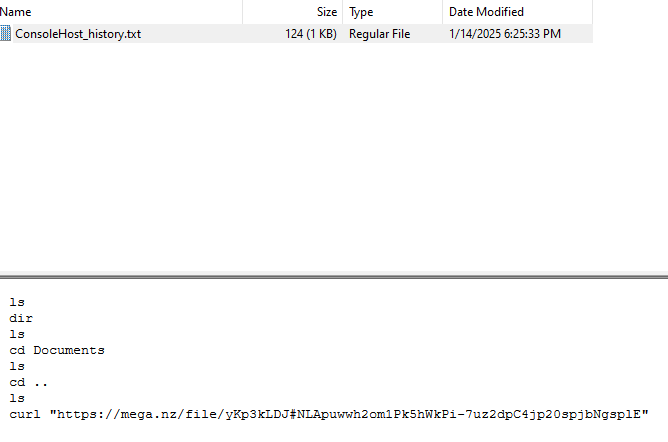

Truy cập ảnh


# _Noted_

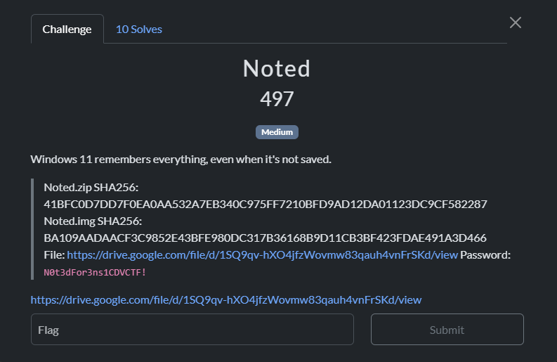

Bài cho file .img, theo tiêu đề có ghi là `Windows 11 remembers everything, even when it's not saved.` và tên bài `Noted` nên mình nghĩ đến tính năng  `auto-save` của `Notepad`

Tiến hành check theo path `C:\Users\\AppData\Local\Packages\Microsoft.WindowsNotepad_8wekyb3d8bbwe\LocalState\TabState`

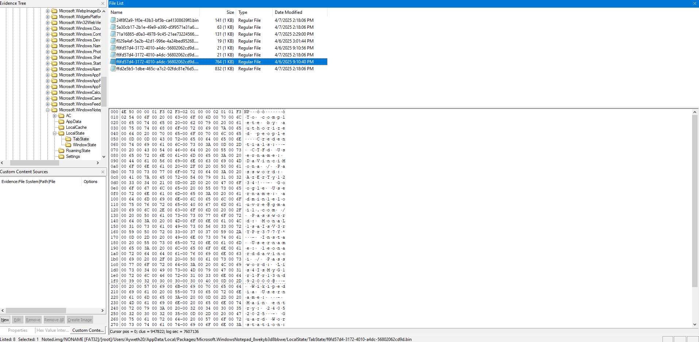

Save all về và xem từng file là lấy được flag

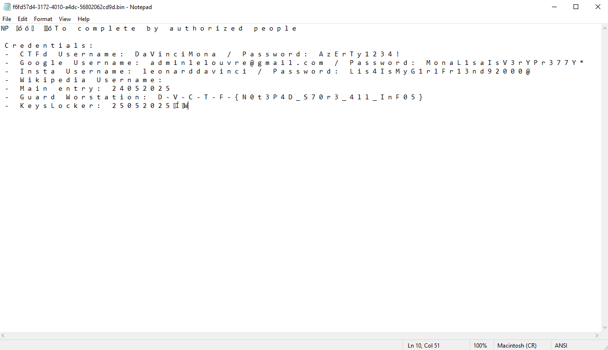

# _Volinux_

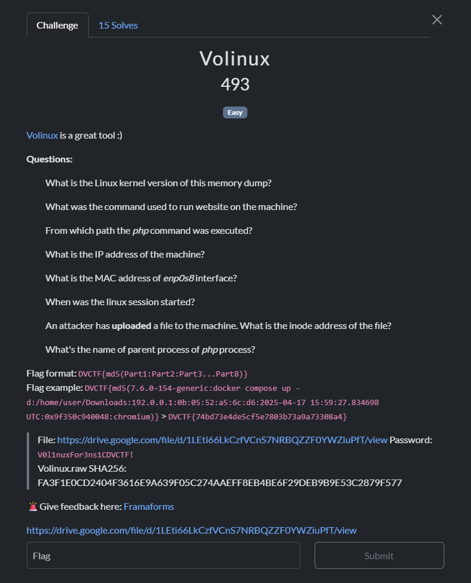

Bài này cho 1 file memdump của linux và có giới thiệu đến 1 tool do chính họ đang phát triển là `volinux`, cốt lõi là nó dựa trên volatility3 nhưng dạng GUI

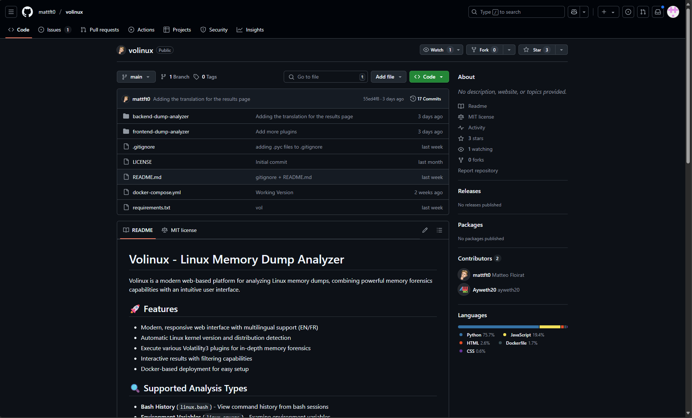

Có được tool này cũng hay tại nó sẽ tự động nhận diện nên sẽ bỏ qua được bước build kernel, symbol... thủ công

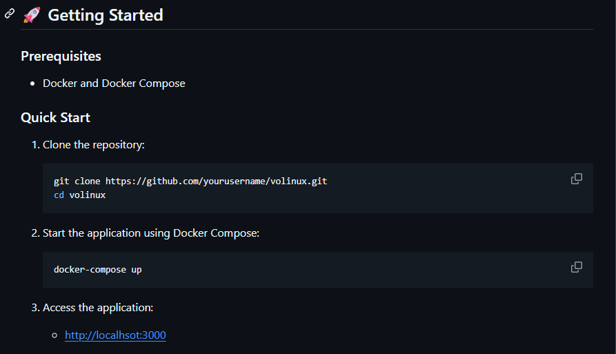

Làm theo hướng dẫn là mình sẽ truy cập được web, drop file vô rồi tiến hành phân tích

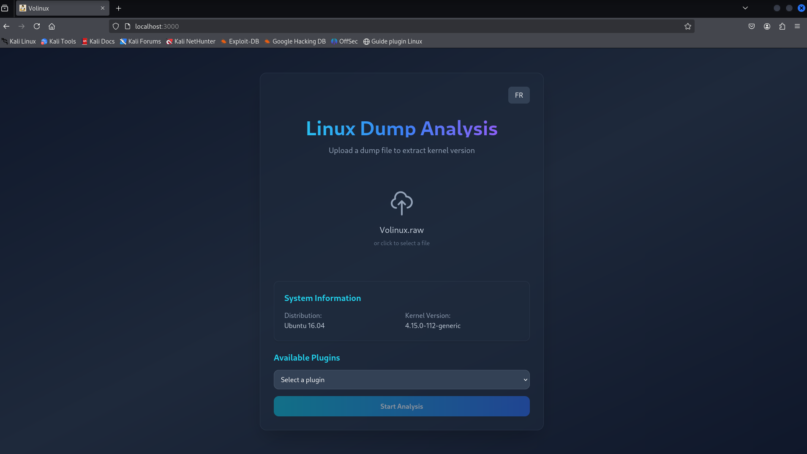

>Q1. What is the Linux kernel version of this memory dump?

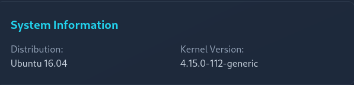

Cái này tương ứng với `banners.Banners`

`Answer: 4.15.0-112-generic`

>Q2. What was the command used to run website on the machine?

Câu này mình sẽ đi chọn plugin `Bash history` tương ứng với `linux.bash`

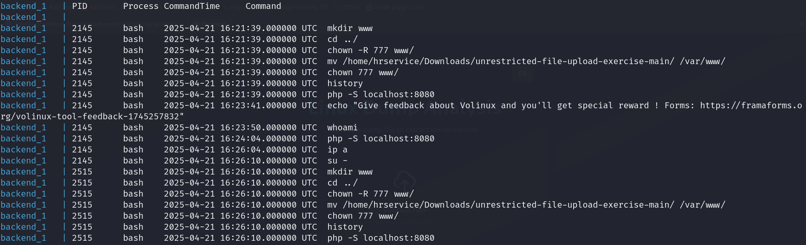

Có thể thấy được hành vi của attacker là dựng máy chủ PHP, cấp quyền,... sau đó khởi chạy server cục bộ bằng lệnh `php -S localhost:8080`

`Answer: php -S localhost:8080`

>Q4. What is the IP address of the machine?

Chọn plugin `IP address` tương ứng với `linux.ip.Addr`

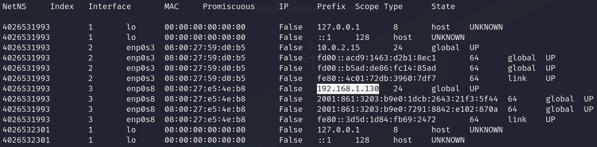

`Answer: 192.168.1.130`

>Q5. What is the MAC address of enp0s8 interface?

Vẫn trong hình trên ta có được ngay địa chỉ MAC

`Answer: 08:00:27:e5:4e:b8`

>Q6. When was the linux session started?

Dùng `Bootime info` tương ứng với `linux.boottime.Boottime`

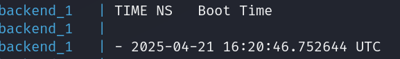

`Answer: 2025-04-21 16:20:46.752644 UTC`

>Q8. What's the name of parent process of php process?


PID 1227 là tiến trình cha của `php`, lướt lên xíu để tìm tên


`Answer: upstart`

>Q7. An attacker has uploaded a file to the machine. What is the inode address of the file?

Dùng plugin `List File in Memory` tương đương với `linux.pagecache.Files`

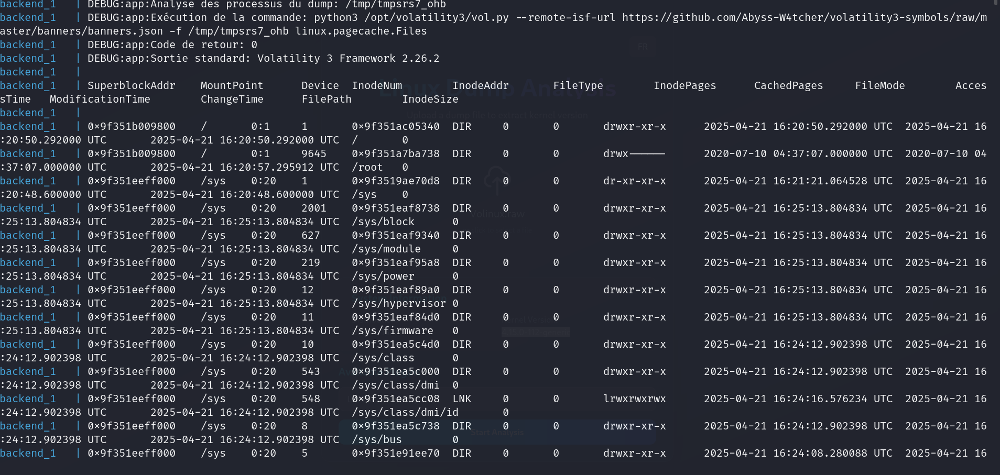

Vì mình đã check qua `bash history` thì thấy được một lệnh `php -S localhost:8080` đã được chạy. Khi chạy thì PHP sẽ tự động dùng thư mục hiện tại làm web root, cho phép truy cập hay upload các file .php

Nên mình sẽ tìm theo extension .php thì tìm thấy 1 file với tên `CVEugeneDELACROIX.pdf.php` trông rất khả nghi

`backend_1   | 0x9f351d64d000    /       8:1     392545  0x9f35145b2770  REG     3       0       -rw-r--r--      2025-04-21 16:25:03.071470 UTC 2025-04-21 16:24:52.346110 UTC  2025-04-21 16:24:52.434154 UTC  /var/www/unrestricted-file-upload-exercise-main/victim-service/uploads/CVEugeneDELACROIX.pdf.php`  

Thứ tự các mốc thời gian kịch bản của attacker như sau:

| Thời gian (UTC)             | Hành động                                                                      | Nguồn dữ liệu                |
|-----------------------------|----------------------------------------------------------------------------------|------------------------------|
| 2025-04-21 16:21:39         | Khởi chạy server PHP lần đầu với `php -S localhost:8080`                        | `linux.bash` (PID 2145)      |
| 2025-04-21 16:24:04         | Server PHP được khởi chạy lại (có thể là restart để cập nhật mã nguồn)         | `linux.bash` (PID 2145)      |
| 2025-04-21 16:24:52.346110  | **File `CVEugeneDELACROIX.pdf.php` được upload/lưu (ModificationTime)**        | `linux.pagecache.Files`      |
| 2025-04-21 16:25:03.071470  | **File `CVEugeneDELACROIX.pdf.php` được truy cập/thực thi (AccessTime)**       | `linux.pagecache.Files`      |

`Answer: 0x9f35145b2770`

>Q3. From which path the php command was executed?

Như phân tích ở trên, nếu chỉ nhìn vào `Bash history` thì chưa thể biết chính xác path mà attacker đang đứng. Do server được khởi chạy trước khi `upload` nên path mà attacker đang đứng sẽ lùi lại 1 thư mục so với vị trí của file `CVEugeneDELACROIX.pdf.php`

`Answer: /var/www/unrestricted-file-upload-exercise-main/victim-service`

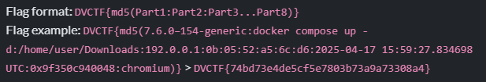

Nối chúng lại theo đúng format và tính md5

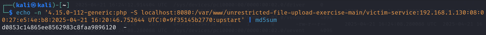

`Flag: DVCTF{d0853c14865ee8562983c8faa9896120}`

# _The Breakage_

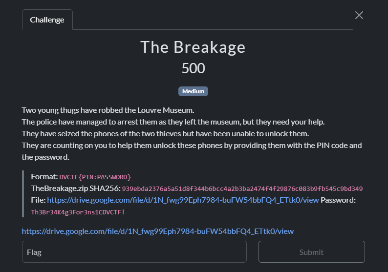

Bài cho 2 tệp .img của 2 điện thoại android, load vô FTK để extract `data` rồi phân tích

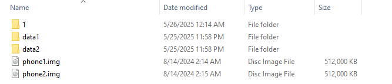

Bài mô tả cần `PIN` của phone1 và `Password` của phone2 để tạo thành flag `DVCTF{PIN:PASSWORD}`, hướng đi là crack bằng hashcat

Bước đầu là phải dựng `hash` của cả 2 máy, đọc blog [này](https://www.pentestpartners.com/security-blog/cracking-android-passwords-a-how-to/) là làm được

- Phone 1:

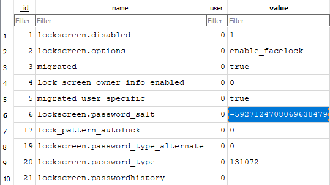

Do `salt` lấy ra là số âm nên có 1 số khác biệt, dùng script sau:

```python
salt = -5927124708069638479

# Chuyển số âm thành 8 byte (big endian, bù hai)
salt_bytes = salt.to_bytes(8, byteorder='big', signed=True)

# Chuyển bytes thành chuỗi hex lowercase
salt_hex = salt_bytes.hex()

print(salt_hex)
```

`md5 + salt`: FD55A53B6A21E46C41F82C2FDAE82620:adbe9f7b34117eb1

Tiến hành crack: `hashcat -m 10 FD55A53B6A21E46C41F82C2FDAE82620:adbe9f7b34117eb1 -a 3 ?d?d?d?d?d?d?d?d`

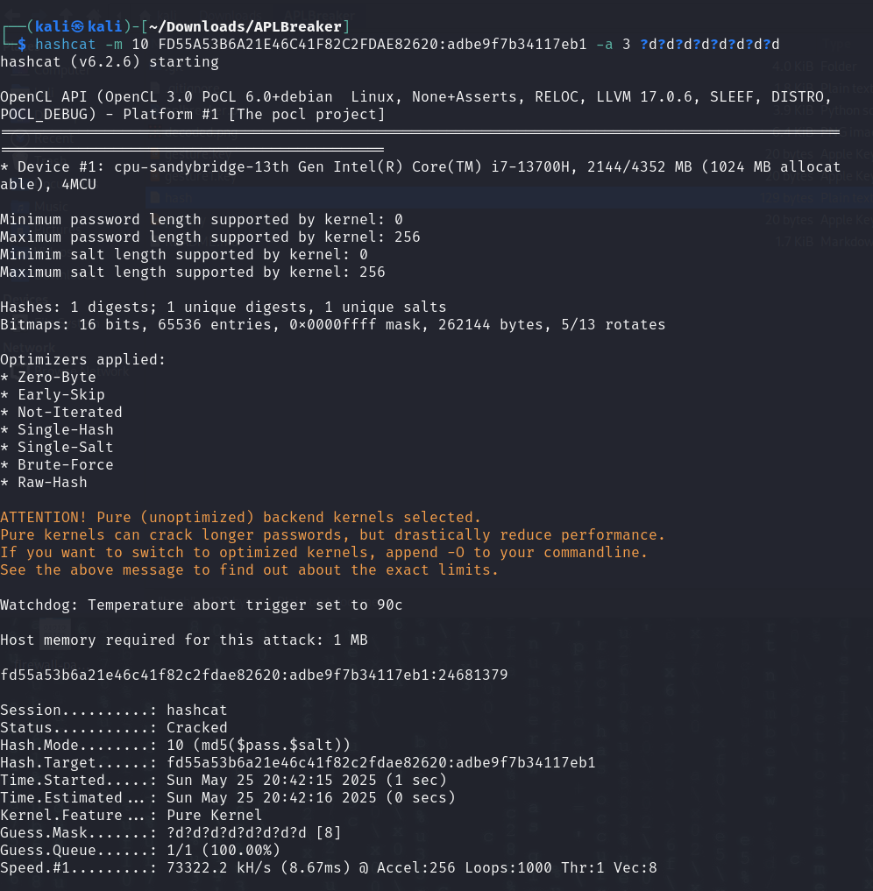

=> PIN: `24681379`

- Phone 2: Tương tự Phone 1

`md5 + salt`: 1F2E0A7B9912B973B9FB1BB6AADCDE7C:9fb610735c471ce4

`hashcat -m 10 1F2E0A7B9912B973B9FB1BB6AADCDE7C:9fb610735c471ce4 /home/kali/Documents/rockyou.txt `

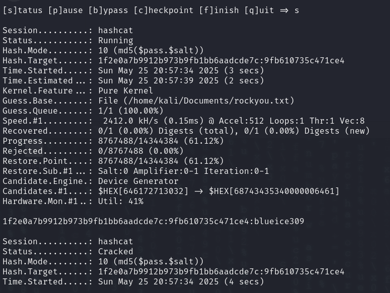

=> PASSWORD: `blueice309`

```FLAG: DVCTF{24681379:blueice309}```

