# _RAMble Reconstruction_

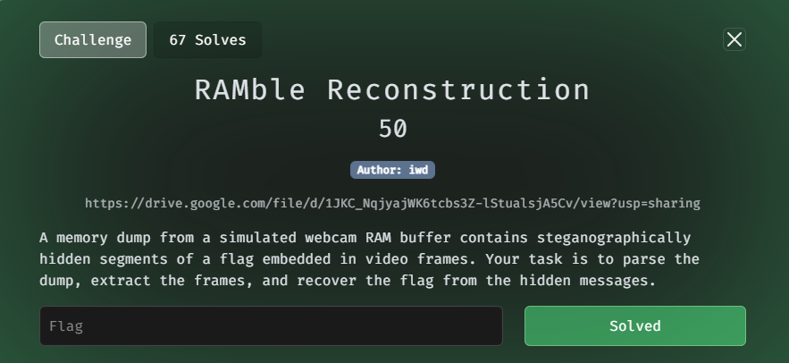

Theo mô tả thì đây là một bản `dump` chứa rất nhiều khung hình của 1 `webcam`, xác nhận ban đầu thì đều là ảnh `PNG`

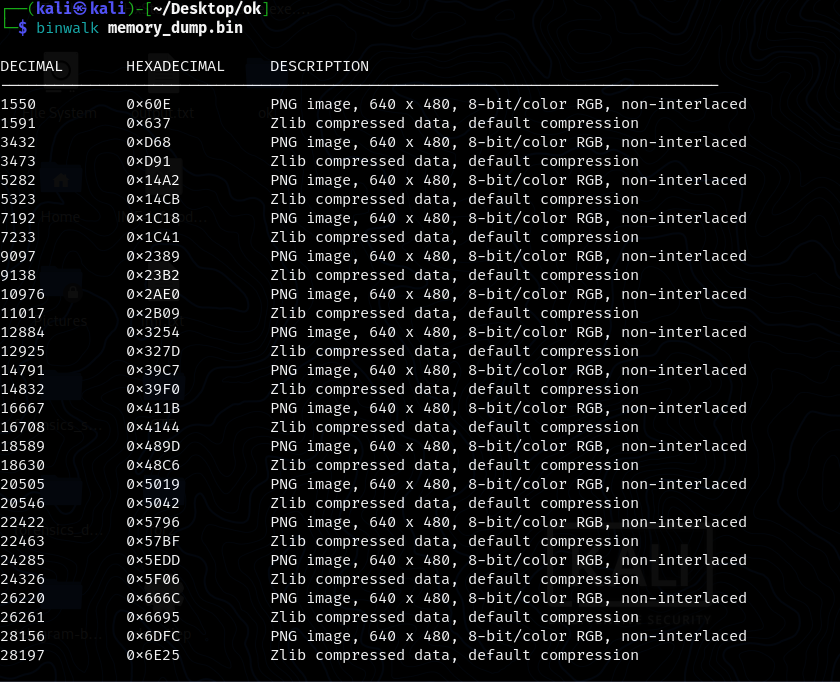

Tiến hành `extract` hết đống đó thu được các khung hình với toàn màu đen :<

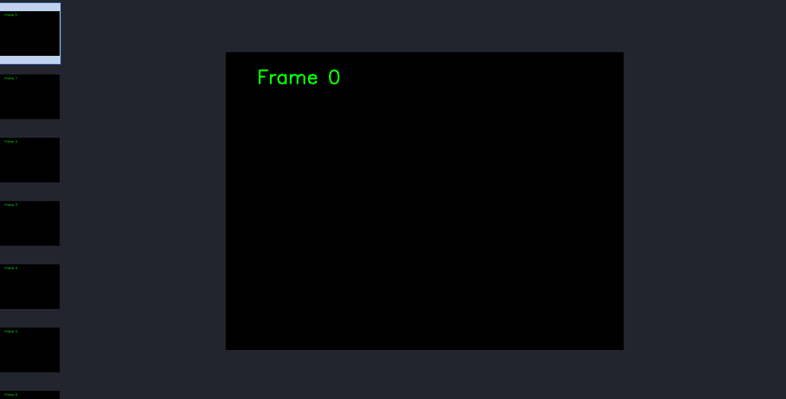

Mình thử một số tool liên quan đến `PNG` thì không thu được lại thông tin gì hữu ích, nên chỉ còn một thứ duy nhất là flag được ẩn giấu trong các kênh `LSB`. Và đây là script python mình dùng để tìm flag

```python
import os
from PIL import Image

def extract_lsb(img_path):
    img = Image.open(img_path)
    bits = ""
    for pixel in list(img.getdata()):
        for channel in pixel[:3]:  # RGB
            bits += str(channel & 1)
    chars = [chr(int(bits[i:i+8], 2)) for i in range(0, len(bits), 8)]
    msg = ''.join(chars)
    return msg.split('\x00')[0]

folder = "png"
for file in sorted(os.listdir(folder)):
    if file.endswith(".png"):
        path = os.path.join(folder, file)
        message = extract_lsb(path)
        if "flag" in message or message.strip():
            print(f"{message}")
```

Đoạn mã lần lượt trích xuất các bit cuối của mỗi kênh màu (R,G,B) trong từng pixel, sau đó ghép chúng lại thành chuỗi nhị phân và chuyển sang kí tự tương ứng

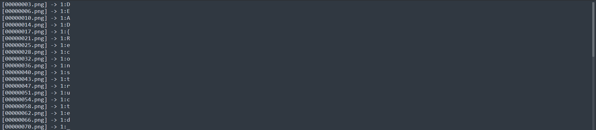

Flag: `DEAD{Reconstructed_From_Webcam_RAM_Buff3rs!}`

# _TradeTrap_1_

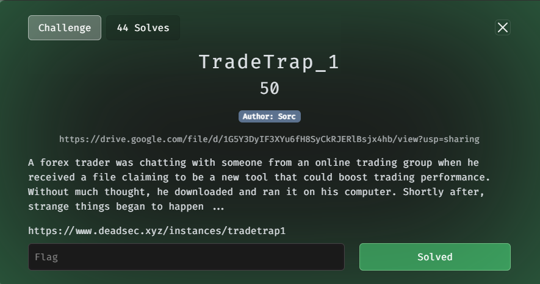

`nc` vào `server` và tiến hành phân tích để trả lời câu hỏi

>Q1. What is the name of the messaging application used by the attacker to communicate with the victim?

Mình lưới phần `download` của user thì thấy được có tải `discord` về nên mình lấy đó làm đáp án thì đúng

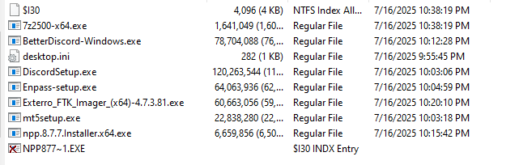

>Q2. What is the Victim's and the attacker's username on the identified messaging platform? (format: victim:attacker)

Để biết được `username` thì ta phải có được đoạn chat của họ. Thông tin này sẽ được lưu trữ trong `Cache` của `Discord`. Vì nó lưu trữ dưới dạng `binary blob` từ Chromium nên mình có thể dùng `ChromeCacheVie` để trích xuất data.

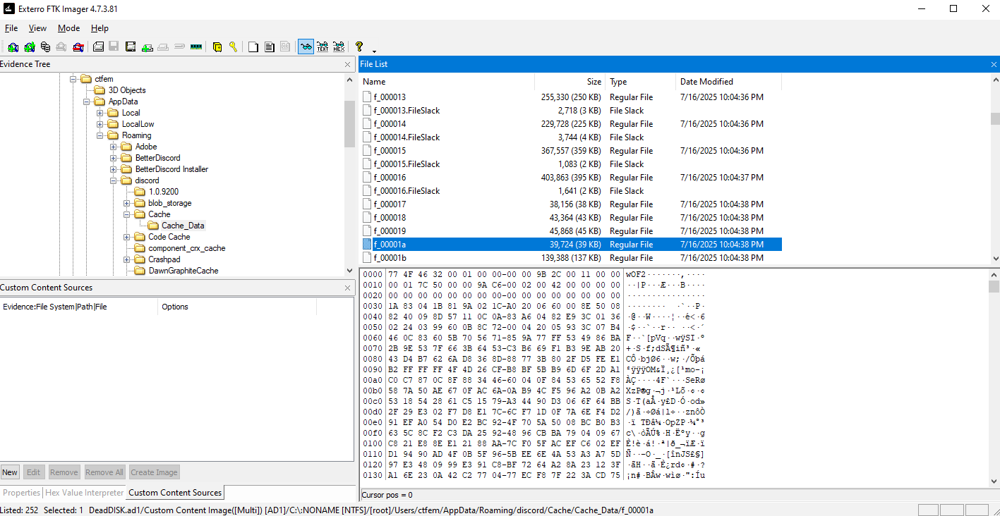

Save toàn bộ folder đó về, tìm đến file json lưu trữ `message` mình có được thông tin sau

```json
[
  {
    "type": 0,
    "content": "https://drive.google.com/drive/folders/125DX3vgsbsnIuJ5KBzi5yl1upCx1guXI\nhey note that the files got password which is : \"password\"\nbecause its a VIP indicator , tell me ur opinion when u try it",
    "mentions": [],
    "mention_roles": [],
    "attachments": [],
    "embeds": [
      {
        "type": "link",
        "url": "https://drive.google.com/drive/folders/125DX3vgsbsnIuJ5KBzi5yl1upCx1guXI",
        "provider": {
          "name": "Google Drive"
        },
        "content_scan_version": 0
      }
    ],
    "timestamp": "2025-07-16T22:35:44.865000+00:00",
    "edited_timestamp": null,
    "flags": 0,
    "components": [],
    "id": "1395172079787311254",
    "channel_id": "1393930208381501633",
    "author": {
      "id": "1393176667836518503",
      "username": "forexwhale_",
      "avatar": null,
      "discriminator": "0",
      "public_flags": 0,
      "flags": 0,
      "banner": null,
      "accent_color": null,
      "global_name": "ForexWhale",
      "avatar_decoration_data": null,
      "collectibles": null,
      "display_name_styles": null,
      "banner_color": null,
      "clan": null,
      "primary_guild": null
    },
    "pinned": false,
    "mention_everyone": false,
    "tts": false
  },
  {
    "type": 0,
    "content": "yes sure bro why not , send it",
    "mentions": [],
    "mention_roles": [],
    "attachments": [],
    "embeds": [],
    "timestamp": "2025-07-16T22:34:22.586000+00:00",
    "edited_timestamp": null,
    "flags": 0,
    "components": [],
    "id": "1395171734683910245",
    "channel_id": "1393930208381501633",
    "author": {
      "id": "1393661744194392185",
      "username": "forexian0",
      "avatar": null,
      "discriminator": "0",
      "public_flags": 0,
      "flags": 0,
      "banner": null,
      "accent_color": null,
      "global_name": "forexiano",
      "avatar_decoration_data": null,
      "collectibles": null,
      "display_name_styles": null,
      "banner_color": null,
      "clan": null,
      "primary_guild": null
    },
    "pinned": false,
    "mention_everyone": false,
    "tts": false
  },
  {
    "type": 0,
    "content": "hey man i've just received the newest forensics indicator it also has this discord plugin that opens the chart website as soon as u open discord wanna check it out ?",
    "mentions": [],
    "mention_roles": [],
    "attachments": [],
    "embeds": [],
    "timestamp": "2025-07-16T22:33:02.380000+00:00",
    "edited_timestamp": null,
    "flags": 0,
    "components": [],
    "id": "1395171398275567626",
    "channel_id": "1393930208381501633",
    "author": {
      "id": "1393176667836518503",
      "username": "forexwhale_",
      "avatar": null,
      "discriminator": "0",
      "public_flags": 0,
      "flags": 0,
      "banner": null,
      "accent_color": null,
      "global_name": "ForexWhale",
      "avatar_decoration_data": null,
      "collectibles": null,
      "display_name_styles": null,
      "banner_color": null,
      "clan": null,
      "primary_guild": null
    },
    "pinned": false,
    "mention_everyone": false,
    "tts": false
  }
]

```

Từ đoạn `json` trên thấy được user `forexwhale_` gửi một đường link drive lạ cho user `forexiano` có kèm theo lời nhắn gợi ý về một `Plugin Discord` => attacker `forexwhale_` và victim `forexiano`

`Answer: forexwhale_:forexian0`

>Q3. When was the url that inlcuded the malicious files sent? (format: yyyy-mm-dd hh:mm:ss)

Vẫn trong đoạn json trên

`Answer: 2025-07-16 22:35:44`

>Q4. What is the name of the file sent by the attacker that redirected the victim to a phishing website?

Truy cập link drive trên, pass là `password` (được đề cập trong đoạn `json`)

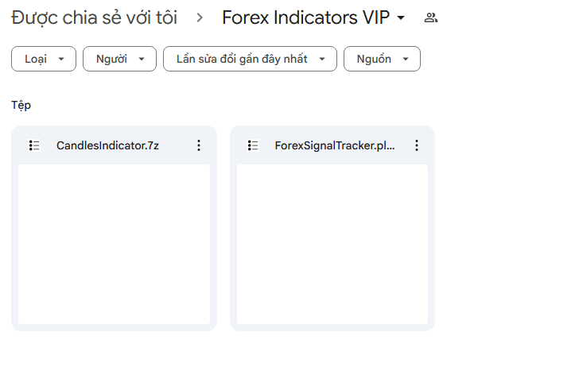

Mở file `js` ra xem thử

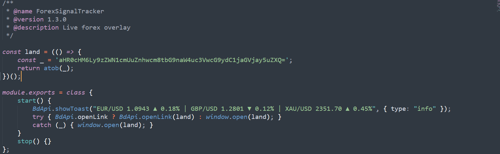

Đoạn mã trên thực hiện hiển thị một dòng fake thông báo update tỉ giá, sau đó nó tự mở một `URL` đã bị `b64 encode` 

`Answer: ForexSignalTracker.plugin.js`

>Q5. What is the full URL or domain name of the phishing website used in the attack?

Decode b64 trên là lấy được `URL` 

`Answer: https://secure.fxpro-login.support-check.net`

>Q6. What is the SHA-256 hash of the second malicious file that granted the attacker access to the victim's machine?

Ngoài file `js` còn 1 file `exe` khác nữa

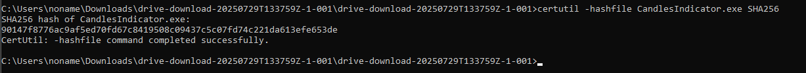

`Answer: 90147f8776ac9af5ed70fd67c8419508c09437c5c07fd74c221da613efe653de`

Tổng hợp đáp án:

```                                                                        
┌──(kali㉿kali)-[~]
└─$ nc nc.deadsec.quest 31842
What is the name of the messaging application used by the attacker to communicate with the victim?
Your answer: discord
Correct! ✅ Moving to the next question.
What is the Victim's and the attacker's username on the identified messaging platform? (format: victim:attacker)
Your answer: forexian0:forexwhale_
Correct! ✅ Moving to the next question.
When was the url that inlcuded the malicious files sent? (format: yyyy-mm-dd hh:mm:ss)
Your answer: 2025-07-16 22:35:44
Correct! ✅ Moving to the next question.
What is the name of the file sent by the attacker that redirected the victim to a phishing website?
Your answer: ForexSignalTracker.plugin.js
Correct! ✅ Moving to the next question.
What is the full URL or domain name of the phishing website used in the attack?
Your answer: https://secure.fxpro-login.support-check.net
Correct! ✅ Moving to the next question.
What is the SHA-256 hash of the second malicious file that granted the attacker access to the victim's machine?
Your answer: 1990ea4aa21fe3ba67b5a9feb3ec2e8477704908caf3703687c5b63d96c668a8
Incorrect! ❌ Try harder.
Your answer: 90147f8776ac9af5ed70fd67c8419508c09437c5c07fd74c221da613efe653de
Correct! ✅
Good Job! You answered all questions correctly! 🔥 Here is your flag:
DEAD{cfbc0f40f40aeacb_5c5980de124f3d65}
```

# _TradeTrap_2_

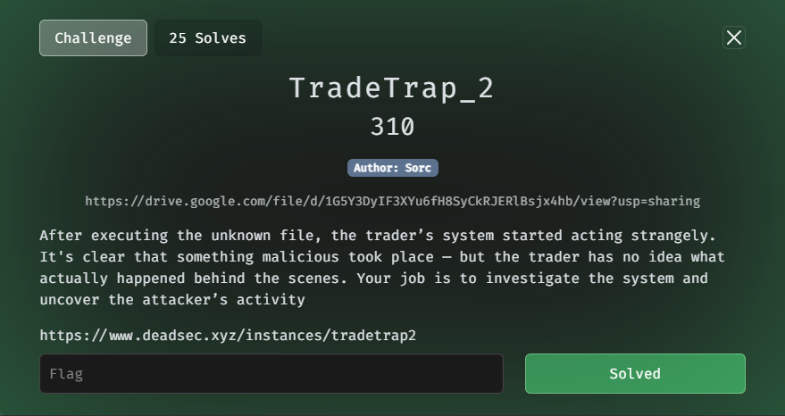

>Q1. When was the malicious executable  executed on the victim's system? (format: yyyy-mm-dd hh:mm:ss)

Hỏi về thời gian thực thi thì mình sẽ check trong `prefetch`, malicious file sẽ là file `exe` ở `TradeTrap1`

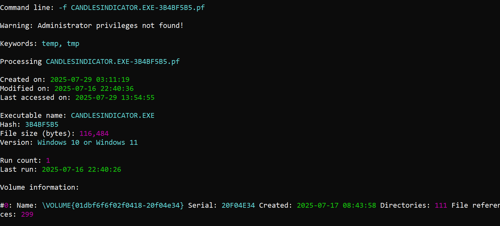

`Answer: 2025-07-16 22:40:26`

>Q2. How many times did this executable run in total?

Vẫn trong câu trên

`Answer: 1`

>Q3. To Maintain persistence the attacker created a new user , what is the name of that user?

Mình sẽ check trong log `Security` với event ID `4720`

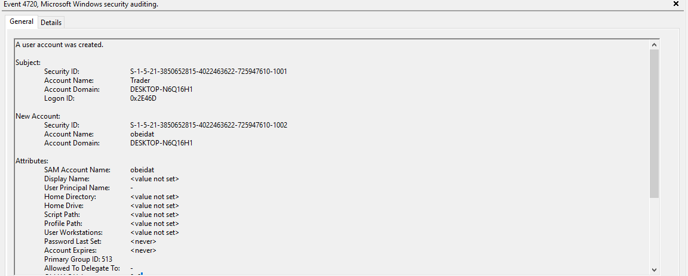

`Answer: obeidat`

>Q4. What is the name of the user that the attacker used to performed the action of creating a new user?

Vẫn trong log đó

`Answer: Trader`

>Q5. The attacker added the new user (obeidat) to a group , name it ?

Vẫn trong log `security` với ID là `4732`

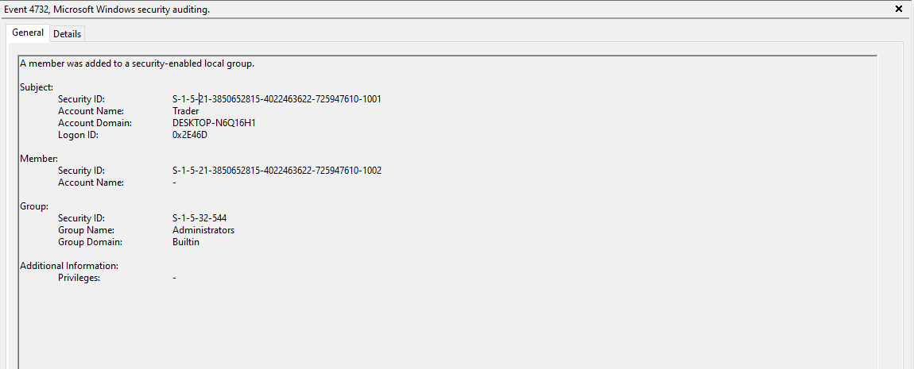


`Answer: Administrators`

>Q6. The Attacker created a copy of the malicious executable that granted him access to the machine , what is the name of the new copy?

Duy trì quyền truy cập chính là cơ chế `persistance`  nên mình sẽ kiểm tra những chỗ quen thuộc. Ở trong `System32/Tasks` mình thấy 1 tác vụ được lập lịch trông khá lạ tên là `SyncService`

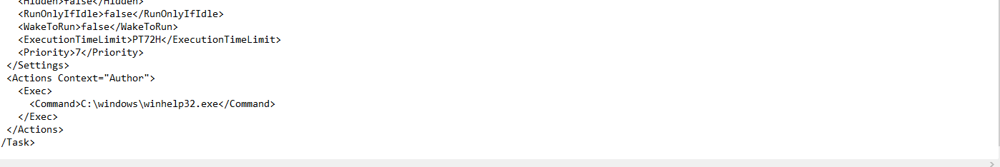

Thấy được file được chạy là `winhelp32.exe`

`Answer: winhelp32.exe`

>Q7. When was that copy created? (format: yyyy-mm-dd hh:mm:ss)

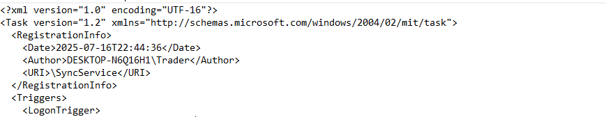

Vì thời gian tạo ra task này là `2025-07-16 22:44:36` nên file `winhelp32.exe` phải được drop vào hệ thống trước đó, mình thử spam một số thời điểm gần đó nhưng sai. Nên giờ sẽ đi tìm thời điểm chính xác. Thử check trong `prefetch` nhưng không thấy sự xuất hiện của file đó, hỏi AI thì có được một tệp lưu trữ lớn hơn là `$MFT`

`File đặc biệt $MFT (Master File Table) trong hệ thống tập tin NTFS lưu trữ toàn bộ thông tin siêu dữ liệu (metadata) của tất cả các file và thư mục trên ổ đĩa`

Mình dùng tool `MFTEcmd` để trích xuất thông tin

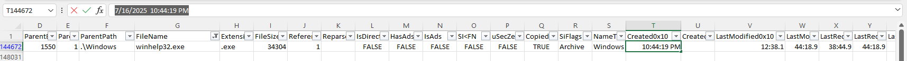

Có được thời gian là `7/16/2025  10:44:19` nhưng mình cũng méo hiểu đáp án đúng lại là -1 giây hmm

`Answer: 2025-07-16 22:44:18`


>Q8. The attacker created a  Scheduled Task using the copy file to maintain persistance , what is the name of the Scheduled Task?

`Scheduled Task` đã xác được xác định từ Q6

`Answer: SyncService`

>Q9. What event or condition triggers the execution of the scheduled task from the previous question?

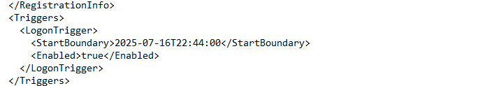

Task được thiết lập sao cho bất cứ khi nào `user` đăng nhập vào máy thì sẽ được kích hoạt chạy

`Answer: Logon`

>Q10. What is the full path of the command or executable configured to run through this Scheduled Task?

Vẫn ở trên `Q6` 

`Answer: C:\windows\winhelp32.exe`

Tổng hợp đáp án:

```
┌──(kali㉿kali)-[~]
└─$ nc nc.deadsec.quest 30413
When was the malicious executable  executed on the victim's system? (format: yyyy-mm-dd hh:mm:ss)
Your answer: 2025-07-16 22:40:26
Correct! ✅ Moving to the next question.
How many times did this executable run in total?
Your answer: 1
Correct! ✅ Moving to the next question.
Your answer: obeidat
Correct! ✅ Moving to the next question.
What is the name of the user that the attacker used to performed the action of creating a new user?
Your answer: Trader
Correct! ✅ Moving to the next question.
The attacker added the new user (obeidat) to a group , name it ?
Your answer: Administrators
Correct! ✅ Moving to the next question.
The Attacker created a copy of the malicious executable that granted him access to the machine , what is the name of the new copy?
Your answer: winhelp32.exe
Correct! ✅ Moving to the next question.
When was that copy created? (format: yyyy-mm-dd hh:mm:ss)
Your answer: 2025-07-16 22:44:18
Correct! ✅ Moving to the next question.
The attacker created a  Scheduled Task using the copy file to maintain persistance , what is the name of the Scheduled Task?
Your answer: SyncService
Correct! ✅ Moving to the next question.
What event or condition triggers the execution of the scheduled task from the previous question?
Your answer: Logon
Correct! ✅ Moving to the next question.
What is the full path of the command or executable configured to run through this Scheduled Task?
Your answer: C:\windows\winhelp32.exe
Correct! ✅
Good Job! You answered all questions correctly! 🔥 Here is your flag:
DEAD{94d4d4b54ededf44_64ee73d8f13a5b45}
```

# _TradeTrap_3_

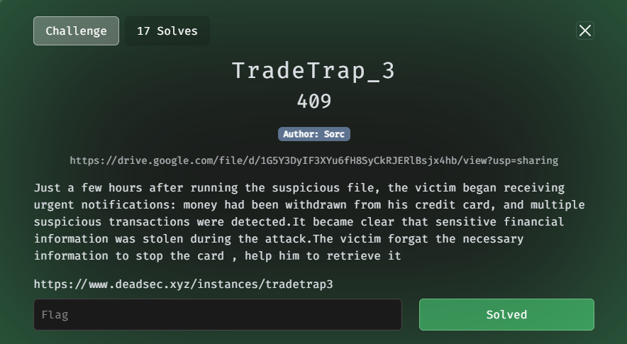

Vẫn theo series đó và giờ là phần cuối

>Q1. What is the name of the password manager or vault application used by the victim?

Trong thư mục `Downloads` mình xem ở phần 1 thì cũng có 1 tệp `exe` liên quan đến ứng dụng `password manager` là `Enpass` và nó cũng chính là đáp án

`Answer: Enpass`

>Q2. What is the number of iterations used in the key derivation function (KDF) of the Enpass vault?

Mình kh rõ hướng đi nên tìm kiếm hết 1 lượt thì lấy được 1 file có tên là `vault.json`  được lưu tại `Appdata/Roaming/Sinew.../Enpass/Enpass/Vault/primary`

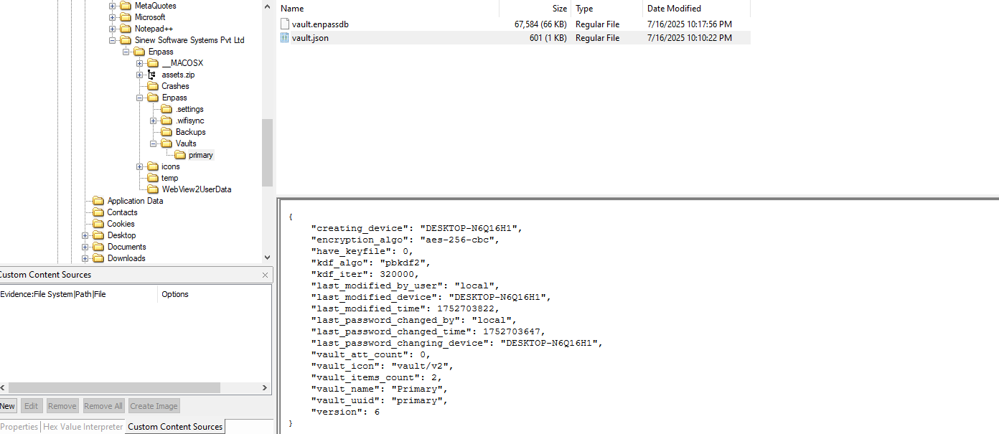

`File này mô tả thông tin meta (metadata) về một "vault" (kho chứa mật khẩu), không chứa trực tiếp dữ liệu nhạy cảm như username/password, mà chỉ mô tả cấu hình.`

Và ta có thể thấy được số lần lặp để sinh khóa là `"kdf_iter": 320000`

`Answer: 320000`

>Q3. What is the decrypted master password used to access the vault?

Vẫn trong path đó ta có được 1 file `vault.enpassdb` đây là một db quan trọng của `enpass` nơi lưu trữ dữ liệu nhạy cảm bao gồm mật khẩu,... của người dùng, ở dạng đã bị mã hóa.

- Đầu tiên ta sinh hash bằng `enpass2join` 

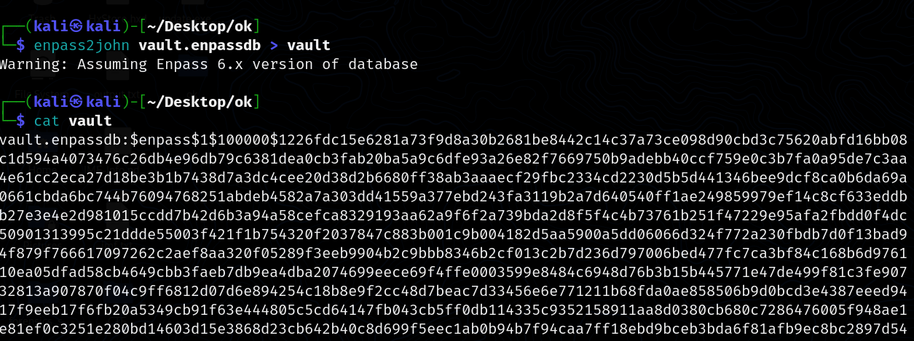

- Lưu ý rằng mới đầu `iterations` sẽ là `100000` nên ta cần thay lại bằng số lần lặp đúng là `320000`

Tiến hành crack

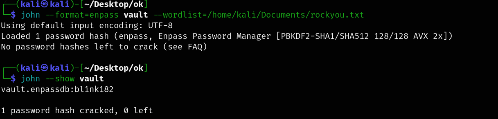

`Answer: blink182`

>Q4. What is the number of the credit card stored within the victim's password vault? (no spaces)

Lấy mật khẩu vừa crack được, kết hợp tải `Enpass` về và add folder `Backups` vào `Enpass` mình lấy được thông tin `credit card` của nạn nhân

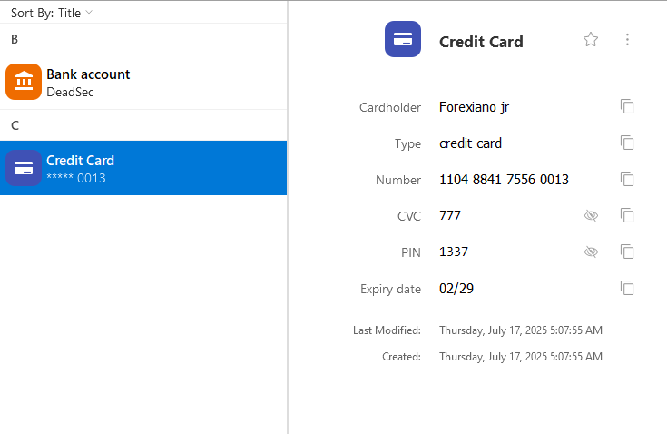

`Answer: 1104884175560013`

>Q5. The attacker started spending the money of the credit card, and the victim just realized the attack he contacted his bank to stop the card but the bank required the account number for validation , the victim forgot to store it in the vault but he NOTED it somewhere else before , what is the bank accout number?

Thấy chữ `noted` được viết hoa nên mình sẽ chú ý đến lưu trữ trong `Notepad`. Mình kiểm tra theo path quen thuộc là `C:\Users\\AppData\Local\Packages\Microsoft.WindowsNotepad_8wekyb3d8bbwe\LocalState\TabState`, nhưng kh thấy sự xuất hiện thì mình đoán đây kh phải là `win11` (vì notepad trên win11 có tính năng `autosave`, dữ liệu sẽ được lưu tại đây!)

Mình lại ngồi mò chay hết một đống thư mục thì có được `victim` lưu trữ trong `Notepad++` 

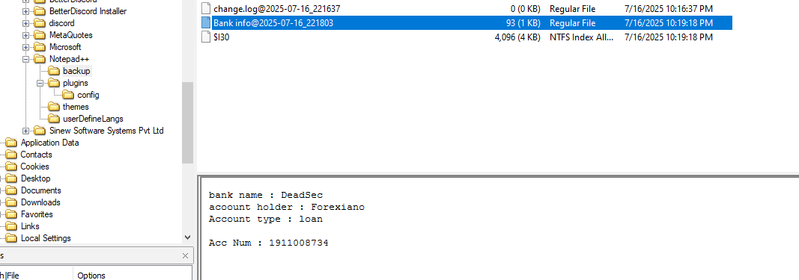

`Answer: 1911008734`
```
┌──(kali㉿kali)-[~]
└─$ nc nc.deadsec.quest 32570
What is the name of the password manager or vault application used by the victim?
Your answer: Enpass
Correct! ✅ Moving to the next question.
What is the number of iterations used in the key derivation function (KDF) of the Enpass vault?
Your answer: 320000
Correct! ✅ Moving to the next question.
What is the decrypted master password used to access the vault?
Your answer: blink182
Correct! ✅ Moving to the next question.
What is the number of the credit card stored within the victim's password vault? (no spaces)
Your answer: 1104884175560013
Correct! ✅ Moving to the next question.
The attacker started spending the money of the credit card, and the victim just realized the attack he contacted his bank to stop the card but the bank required the account number for validation , the victim forgot to store it in the vault but he NOTED it somewhere else before , what is the bank accout number?
Your answer: 1911008734
Correct! ✅
Good Job! You answered all questions correctly! 🔥 Here is your flag:
DEAD{337954be2dfa9e2d_ef02dc3a63383f61}

```